# Sistema de Reservas

> **Repositório vitrine.** Apenas apresentação do projeto. O código-fonte é privado. Autor: Caio Alba de Camargo.

Sistema web para controle e agendamento corporativo de veículos e salas de reunião, projetado para operar com suporte a múltiplas unidades da empresa, concorrência estrita de horários, perfis granulares de acesso e comunicação automatizada por e-mail.

O projeto foi concebido a partir de necessidades operacionais reais de suporte interno, com arquitetura desenvolvida com apoio de ferramentas de IA (Codex, Gemini, Antigravity) e validada em ambiente de produção com uso ativo por todos os colaboradores.

---

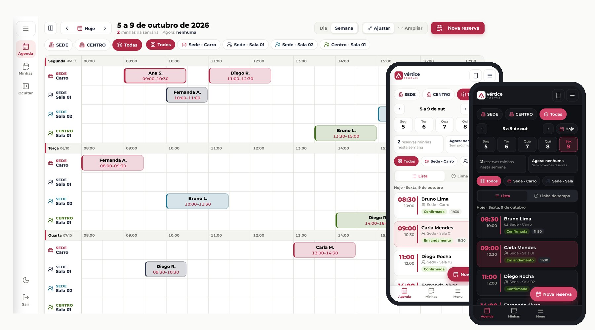

> As capturas e o manual usam a marca fictícia **Vértice** e dados de exemplo (pessoas, reservas e telefones inventados). O sistema real roda com a identidade da empresa onde foi implantado.

## Novidades da versão 6 (outubro/2026)

- **Agenda V6:** visão semanal e diária com linhas por recurso, chips de unidade (Sede, Centro ou Todas) e de recurso, Ajustar e Ampliar a linha do tempo.
- **Celular redesenhado:** chips de dia, resumo "minhas reservas" e "agora", lista do dia, botão flutuante de nova reserva e barra inferior (Agenda, Minhas, Menu).
- **Linha do tempo no celular:** botão **Girar** (vertical ou horizontal), **Ampliar/Ajustar** e toque no nome do recurso para focar só nele; a preferência fica salva no aparelho.
- **Nova tela de entrada:** no computador, formulário ao lado de um painel com fotos de carro e sala; no celular, topo colorido, fotos e rodapé com suporte.
- **E-mails no mesmo visual da agenda:** cartão da reserva com unidade, data por extenso, horário, duração e status; boas-vindas com credenciais, primeiro acesso em 3 passos e instalação no Android e no iPhone.
- **Permissão por recurso:** além da unidade, cada perfil ou colaborador pode ser liberado para recursos específicos (ex.: só as salas).
- **Manual com vídeos:** página que explica sozinha cada tarefa, com um vídeo curto para cada uma e um vídeo completo.
- **Tema claro e escuro** em todas as telas.

## Telas

### Entrada

| Computador | Celular |
|---|---|
| 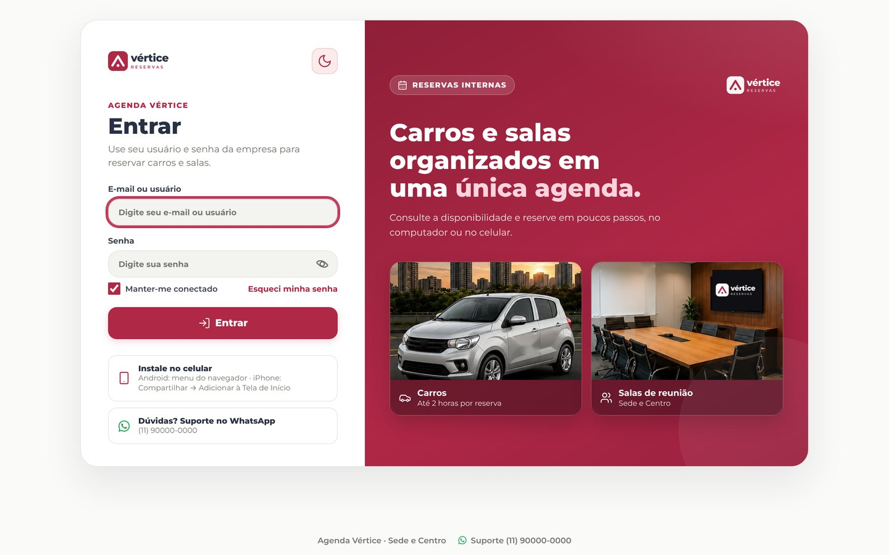 | 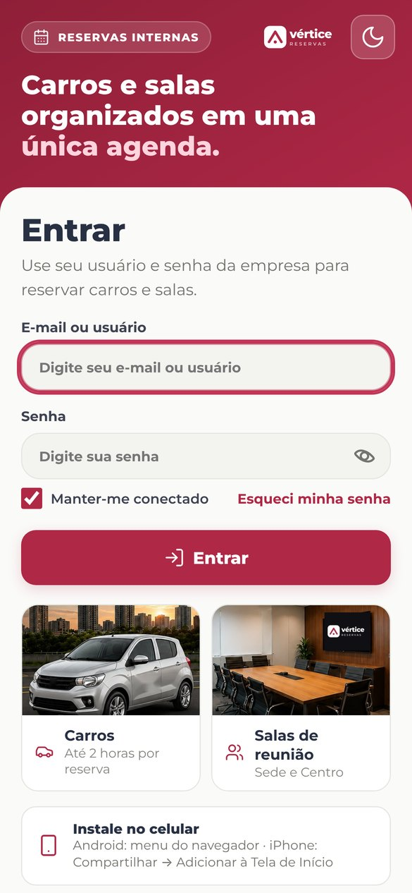 |
| 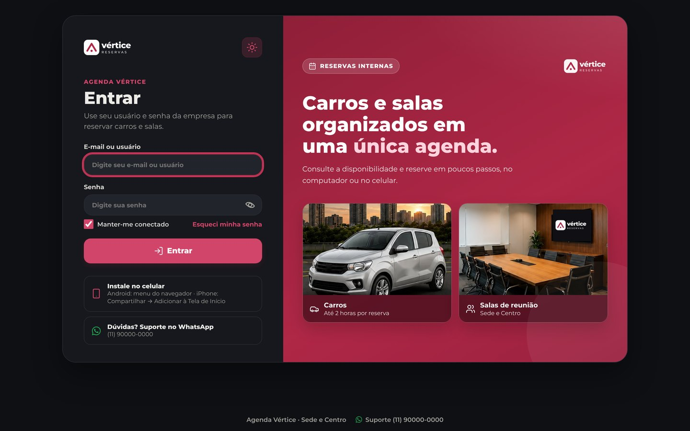 | 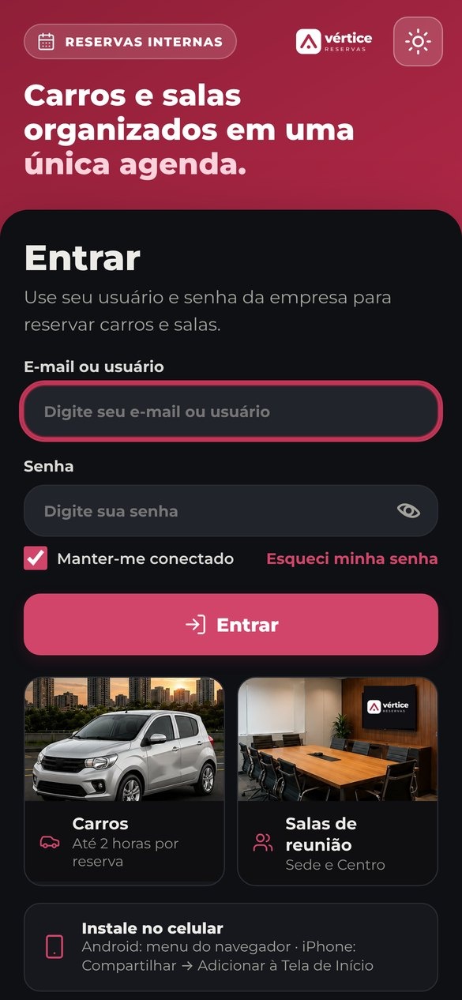 |

### Agenda da semana

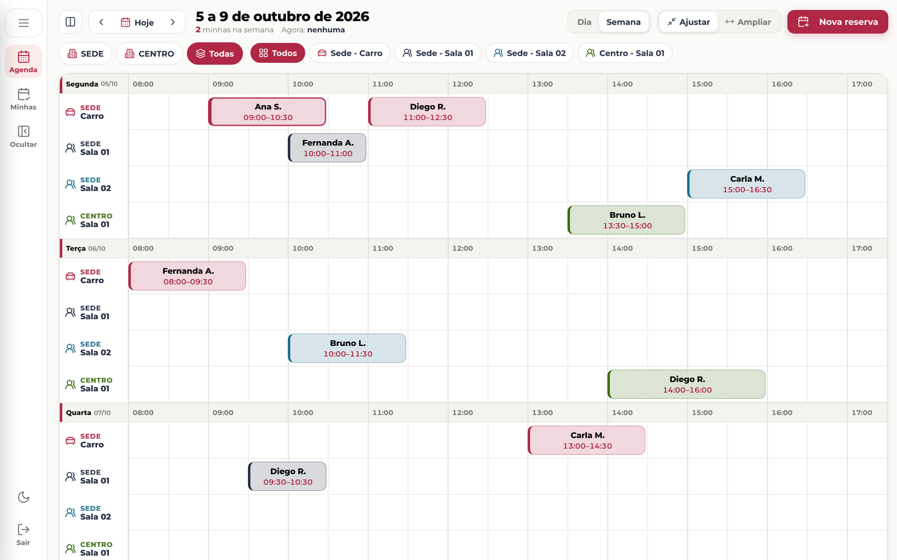

*Visão semanal da agenda por recurso: carro e salas de reunião de duas unidades.*

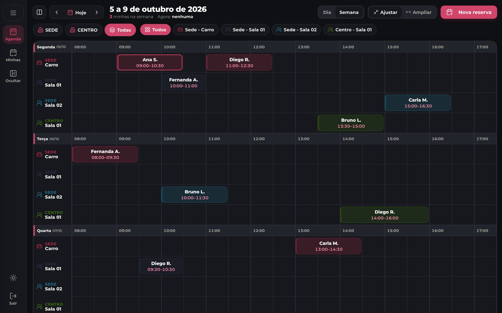

### No celular

| Agenda | Nova reserva | Minhas reservas | Tema escuro |
|---|---|---|---|
| 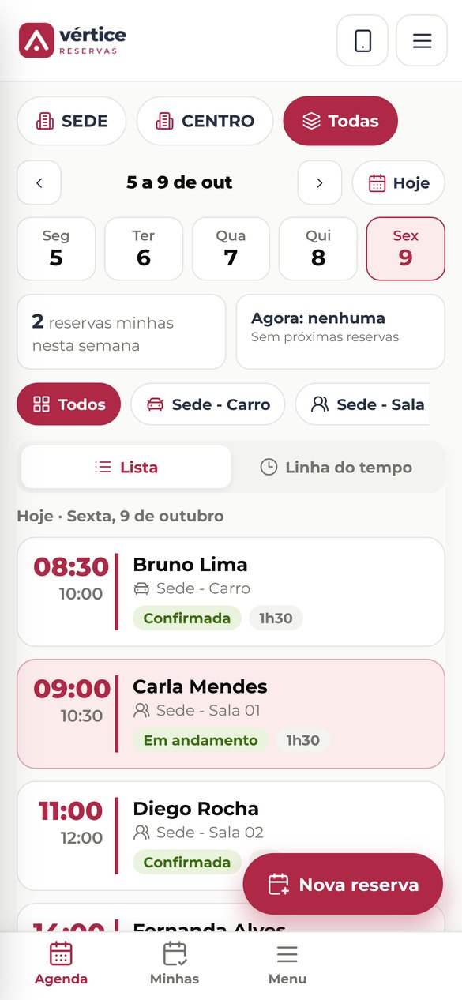 | 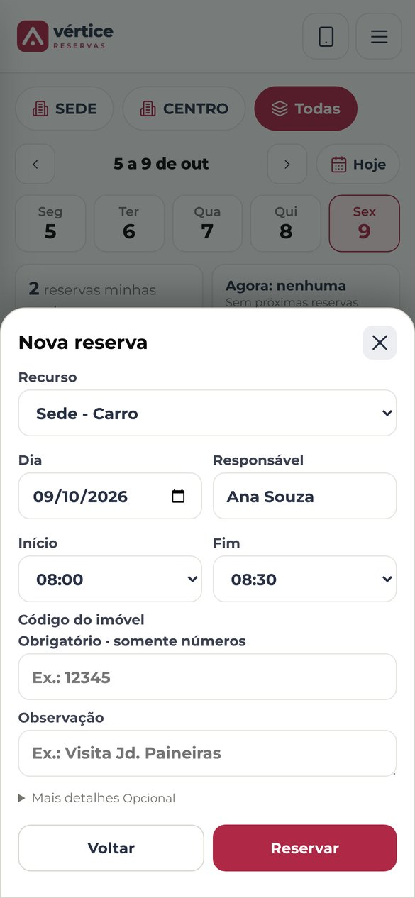 | 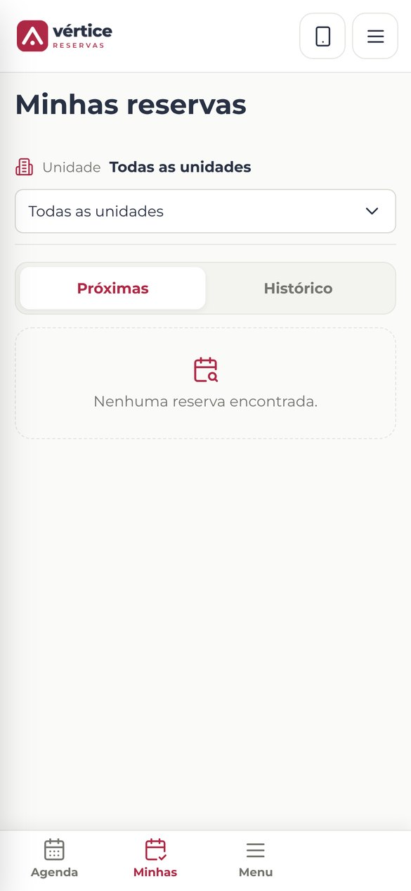 | 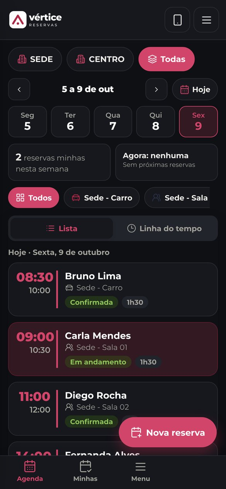 |

### Minhas reservas, painel e administração

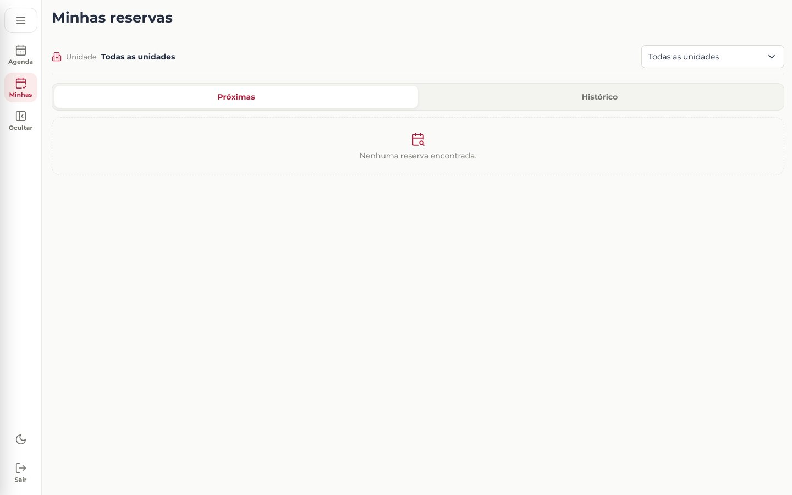
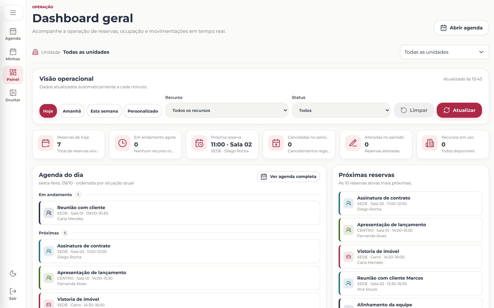
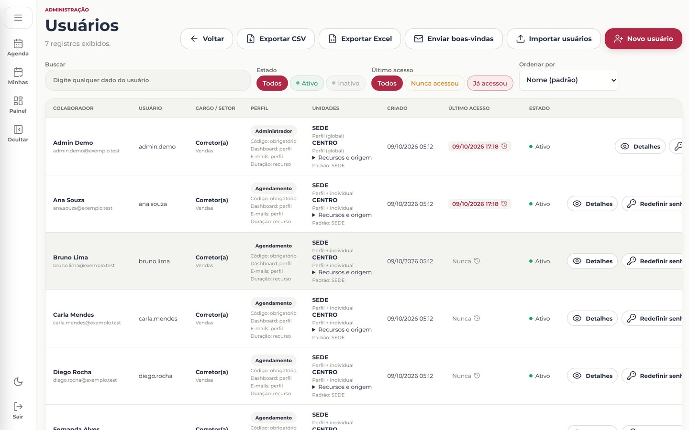

### Manual com vídeos

A pasta [`manual/`](manual/) traz o guia do usuário: passo a passo de cada tarefa (primeiro acesso, reservar carro e sala, ver detalhes, editar, cancelar, minhas reservas, instalar no Android e no iPhone), um vídeo curto para cada uma e um vídeo completo. Os vídeos foram gravados de forma automatizada (Playwright e ffmpeg) num celular emulado, com dedo, destaque e legendas. Para ver a página, baixe a pasta e abra `manual/index.html`, ou ative o GitHub Pages neste repositório.

| Reservar o carro | Linha do tempo | Instalar no iPhone |
|---|---|---|
| 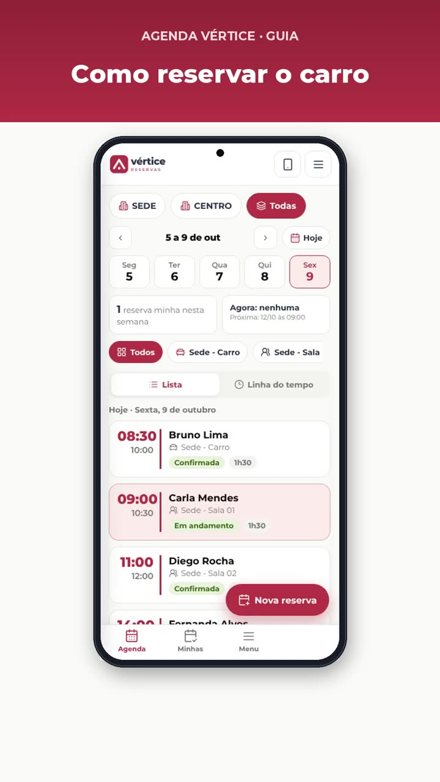 | 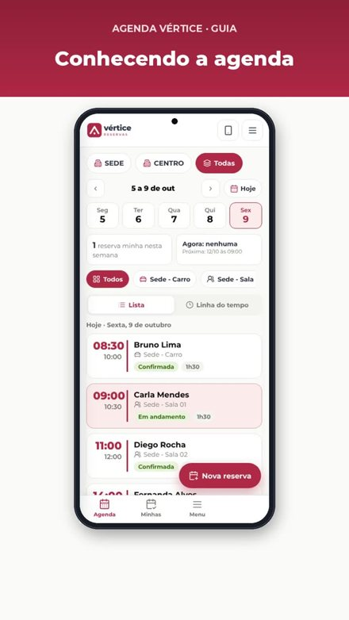 | 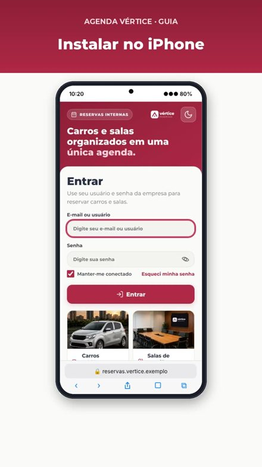 |

---

## 1. Gestão de Permissões e Perfis Personalizados

O sistema conta com um modelo flexível de autorização baseado em perfis (grupos de acesso), flags individuais de permissão e escopo territorial por unidades da empresa.

### Perfis de Acesso e Personalização
- **Administrador (Acesso Global):** Perfil protegido do sistema com acesso irrestrito a todas as funcionalidades, telas administrativas, relatórios, configurações técnicas e dados de todas as unidades.
- **Recepção:** Voltado ao atendimento operacional e gerenciamento diário da agenda. Permite criar, editar e cancelar reservas de qualquer colaborador, escolher responsáveis e consultar logs operacionais.
- **Usuário comum:** Focado no autosserviço corporativo, permitindo consultar disponibilidades, registrar os próprios agendamentos e gerenciar suas reservas conforme as políticas vigentes.
- **Perfis Personalizados Ilimitados:** Administradores podem criar novos perfis (ex.: Gerência, Coordenação, Diretoria) atribuindo descrições personalizadas e selecionando exatamente o conjunto de permissões desejado.

### Matriz Granular de Permissões
O sistema divide o controle de acesso em 19 permissões independentes agrupadas por contexto:
- **Agenda:** Visualização completa da agenda e consulta de disponibilidade dos recursos.
- **Dashboard:** Ativação do acesso ao painel de indicadores e métricas operacionais.
- **Notificações:** Habilitação para recebimento de e-mails globais da agenda (novas reservas, alterações, cancelamentos e lembretes).
- **Reservas:**
  - Criação de novos agendamentos;
  - Edição de reservas próprias;
  - Edição de reservas de qualquer usuário;
  - Cancelamento de reservas próprias;
  - Cancelamento de qualquer reserva do sistema;
  - Atribuição de outro colaborador como responsável (reserva em nome de terceiros).
- **Administração:**
  - Consulta ao cadastro e detalhes de colaboradores;
  - Gerenciamento completo de usuários (inclusão, alteração, redefinição de acessos e importações);
  - Gestão de perfis e atribuição de permissões;
  - Gestão de recursos (veículos, salas e outros ativos);
  - Gestão de regras gerais da agenda (horários de funcionamento e dias úteis).
- **Relatórios:** Consulta a relatórios analíticos de uso e exportação de dados em CSV.
- **Auditoria:** Visualização do histórico de acessos (login, falhas e logout) e auditoria de alterações administrativas.
- **Conta:** Permissão para alteração da própria senha de acesso.

### Combinação de Permissões e Escopo Territorial (Multiunidade)
- **Separação entre função e território:** O perfil do colaborador define *o que* ele pode executar, enquanto o vínculo de unidades define *onde* essas ações são válidas.
- **Vínculos por colaborador:** Um usuário pode estar alocado a uma única unidade, a múltiplas unidades ou possuir acesso global (caso dos administradores).
- **Sobrescrita individual (*Overrides*):** Permite conceder ou revogar permissões específicas diretamente no cadastro de um colaborador sem a necessidade de criar um perfil exclusivo.
- **Exigência condicional de código de negócio:** Configuração individual no perfil do colaborador para tornar obrigatório ou dispensar o preenchimento de código identificador (como imóvel, projeto ou centro de custo) durante o agendamento de recursos específicos (ex.: veículos).

### Regras de Disponibilidade e Conflitos por Recurso
- **Horários e dias de funcionamento flexíveis:** Cada veículo ou sala pode adotar as regras gerais da empresa ou possuir uma grade semanal própria (definindo dias da semana ativos e horários independentes de início e fim).
- **Intervalos padronizados:** Grade com divisões padrão de 15 minutos, facilitando o encaixe de reuniões e deslocamentos.
- **Prevenção atômica de conflitos:** Bloqueio transacional de concorrência em nível de banco de dados, serializando requisições simultâneas e impedindo que dois colaboradores reservem o mesmo recurso no mesmo intervalo.
- **Validações estritas de agendamento:** Bloqueio automático de agendamentos retroativos (no passado), validação de início estritamente anterior ao término e checagem de horários fora do expediente do recurso.
- **Cancelamento lógico auditável:** Reservas canceladas não são excluídas fisicamente do banco de dados; seu histórico permanece registrado com o colaborador responsável pelo cancelamento, data/hora e justificativa formal.

### Área Administrativa Integrada
- **Gestão de Colaboradores:** Cadastro detalhado, controle de estado ativo/inativo, redefinição assistida de senhas temporárias com obrigatoriedade de troca no próximo login e visualização de histórico de agendamentos futuros.
- **Importação em Lote:** Importação automatizada via planilhas CSV ou Excel (.xlsx), permitindo criar usuários, redefinir senhas em massa, atualizar cargos/setores e disparar e-mails de boas-vindas.
- **Catálogo Dinâmico:** Gerenciamento centralizado de cargos e setores para padronização dos formulários de cadastro.
- **Gestão de Recursos e Unidades:** Configuração de cores temáticas para cada ativo, definição de recursos com múltiplos participantes (ex.: salas) e desativação programada com opção de limpeza segura de reservas futuras conflitantes.

---

## 2. SMTP e Notificações por E-mail

O sistema dispõe de um módulo transacional completo de notificações para manter os envolvidos cientes do ciclo de vida de cada agendamento.

### Eventos Notificados Automaticamente
- **Criação de Reserva:** Envio de confirmação imediata para o responsável, para quem realizou a reserva, para os participantes convidados e para a equipe de recepção/gestão com monitoramento global ativo.
- **Alteração de Reserva:** Disparo de aviso com os dados atualizados sempre que houver alteração de horário, data, participantes ou recurso.
- **Cancelamento de Reserva:** Notificação enviada a todos os envolvidos, exibindo destaque visual de cancelamento e o motivo registrado pelo operador.
- **Lembrete Prévio de Início:** Rotina periódica em segundo plano (executada via tarefa agendada) que identifica agendamentos com início iminente (15 minutos antes) e dispara lembretes preventivos aos participantes e responsáveis.
- **Boas-Vindas e Recuperação de Senha:** Envio de credenciais temporárias no primeiro acesso e links seguros para recuperação de senha com tokens de uso único e expiração controlada.

### Modelos de Mensagem (Templates Transacionais)
- E-mails formatados em HTML responsivo com identidade visual corporativa da empresa.
- Destaque em cores e ícones específicos para cada tipo de ativo (veículo corporativo vs sala de reunião).
- Tabela estruturada com unidade, recurso, assunto/finalidade, responsável, data por extenso, horário de início/término e duração total calculada.
- Bloco contextual com motivo de cancelamento quando aplicável.
- Botão de acesso direto para abrir a agenda já posicionada no dia do evento.

### Configuração do Servidor SMTP pela Interface Web
- Painel administrativo dedicado para inserção dos dados de conexão: servidor host, porta e protocolo de segurança (465 com SSL/TLS ou 587 com STARTTLS), conta de usuário, e-mail e nome do remetente corporativo.
- **Criptografia Autenticada em Repouso:** A senha da conta de e-mail é armazenada no banco de dados protegida por criptografia AES-256-GCM, garantindo sigilo contra vazamento em dumps ou backups.
- **Teste de Envio em Tempo Real:** Ferramenta integrada para validação imediata da conexão e do envio para qualquer colaborador ativo antes de efetivar ou alterar os parâmetros de produção.
- **Auditoria de Configurações:** Rastreabilidade de alterações no serviço de e-mail, registrando datas, operadores responsáveis e histórico de testes realizados.

### Tratamento de Falhas e Observabilidade
- **Log Centralizado de Entregas:** Histórico detalhado registrando cada e-mail disparado pelo sistema, com destinatário, reserva associada, tipo de notificação, assunto, data/hora e status final de entrega.
- **Isolamento de Falhas:** Erros de comunicação SMTP não interrompem a transação de agendamento na interface web; a falha é capturada, logada com a mensagem técnica original do servidor e apresentada nos indicadores de saúde do painel.

---

## 3. Recursos Complementares e Experiência do Usuário

### Dashboard Operacional em Tempo Real
- Painel executivo com visão rápida das reservas do dia, do dia seguinte ou da semana.
- Filtros por período, por status (ativas, alteradas, canceladas) e por unidade corporativa.
- Indicadores numéricos de ocupação: total de agendamentos, horas reservadas, distribuição entre veículos e salas, e taxa de cancelamentos.
- Acesso rápido aos detalhes do agendamento e possibilidade de cancelamento direto com justificativa.

### Relatórios Gerenciais e Exportação de Dados
- Consolidação de métricas por período customizado.
- Totalização de horas e utilizações da frota de veículos e das salas.
- Relatórios agrupados por colaborador, cargo e setor da empresa.
- Identificação dos horários de pico e maior procura na agenda.
- Exportação completa dos dados tabulares em formato CSV para integração e análises adicionais em ferramentas de BI.

### Auditoria e Logs de Segurança
- **Log de Acessos:** Registro dos últimos eventos de login bem-sucedido, tentativas recusadas de acesso e encerramento de sessão (logout), acompanhados de data/hora, e-mail informado, endereço IP e identificação do navegador.
- **Auditoria de Operações:** Histórico imutável de ações administrativas com entidade afetada, operador responsável, endereço IP e detalhamento em formato estruturado (dados anteriores e posteriores à modificação).

### Painel "Minhas Reservas"
- Tela exclusiva para o colaborador acompanhar seus agendamentos sem poluição visual.
- Abas separadas entre reservas futuras (próximas) e histórico de utilizações passadas.
- Diferenciação clara entre os agendamentos onde o colaborador é o responsável principal e aqueles onde foi incluído como participante.

### Suporte a PWA e Notificador de Desktop
- **Progressive Web App (PWA):** Manifesto web e Service Worker configurados para permitir a instalação da aplicação na tela de início de smartphones e tablets, proporcionando experiência similar a um aplicativo nativo em dispositivos móveis.
- **Notificador de Desktop para Windows:** Módulo complementar executável em segundo plano na bandeja do sistema operacional (Systray), realizando consultas periódicas para apresentar alertas persistentes na área de trabalho quando novas reservas, cancelamentos ou lembretes forem emitidos para o usuário autenticado.

---

## Tecnologia

- PHP 8 sem framework e MySQL/MariaDB, com transações para impedir conflito de horário.
- HTML, CSS e JavaScript puros (sem etapa de build), fonte Montserrat hospedada no próprio projeto e ícones Lucide.
- PWA (manifesto e Service Worker) para instalar no celular.
- Testes automatizados em PHP rodando em Docker; manual e vídeos gerados com Playwright e ffmpeg.

---

Portfólio: [MaiKO-IA.com.br](https://maiko-ia.com.br)

Autor: [Caio Alba de Camargo](https://github.com/caioalba)
